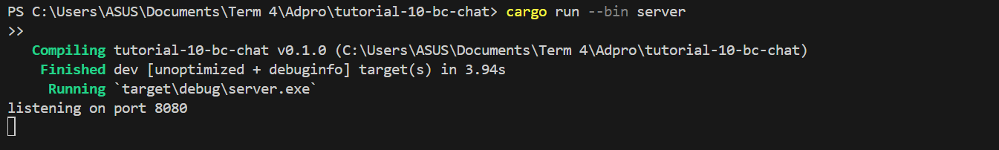
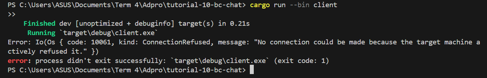
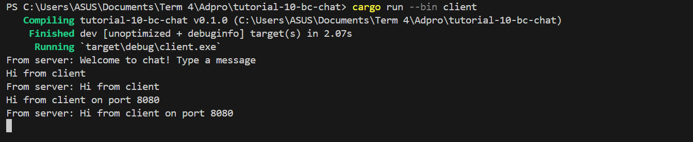
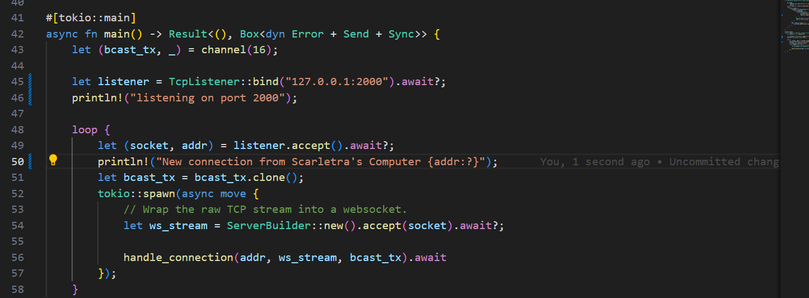
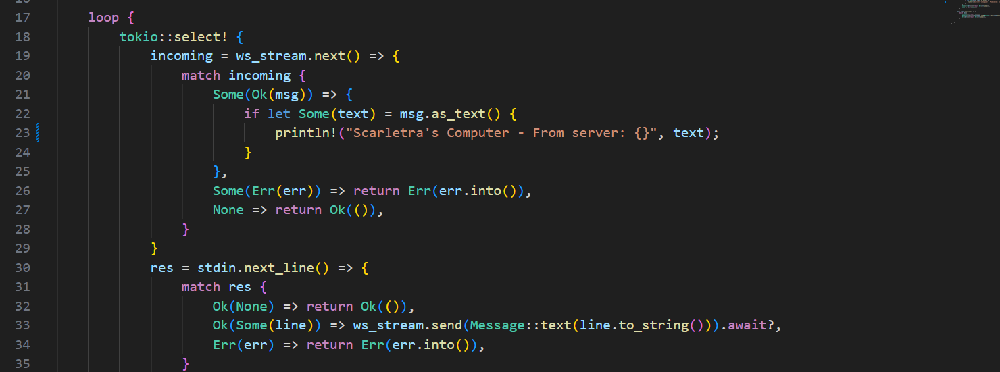
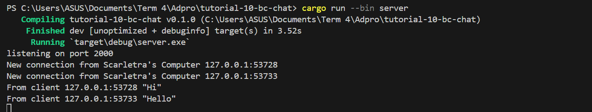
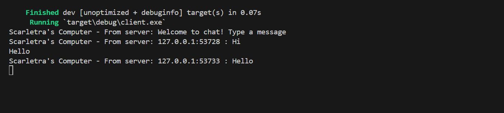

Dari ketiga gambar di atas, bisa diketahui bahwa setelah server dan tiga client dijalankan, output dari setiap client dan server menerima pesan yang diketikkan oleh tiap client. Hal ini bisa dilihat dengan jelas, bahwa ketika saya mengetikkan secara berurutan mulai dari client 1 hingga 3, client lain akan juga mendapatkan pesan sesuai dengan apa yang saya ketikkan di client tertentu. Hal ini disebabkan oleh pesan yang saya ketikkan akan dikirimkan ke server lalu akan diteruskan ke seluruh client yang terhubung dengannya.

Dari kedua gambar di atas, bisa dilihat bahwa ketika saya mencoba melakukan perubahan port pada salah satu sisi saja menyebabkan error pada sisi client (port server 8080). Hal ini disebabkan oleh ketidakadanya koneksi antara client dengan sisi server, sehingga program menjadi crash. Sedangkan, untuk kedua gambar di bawah, ketika kedua sisi (server dan client) kita ubah portnya, maka program akan tetap berjalan dengan normal.

## 2.3

Perubahan output pada kedua gambar output merupakan hasil dari adanya perubahan kode pada bagian server dan juga client (tertera pada gambar di atas). Perubahan tersebut dilakukan supaya bcast.tx (yang merupakan sender) mengirimkan pesan ke setiap client, akan menyertakan informasi pengirim teks melalui variabel addr.