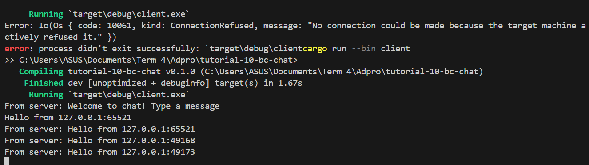
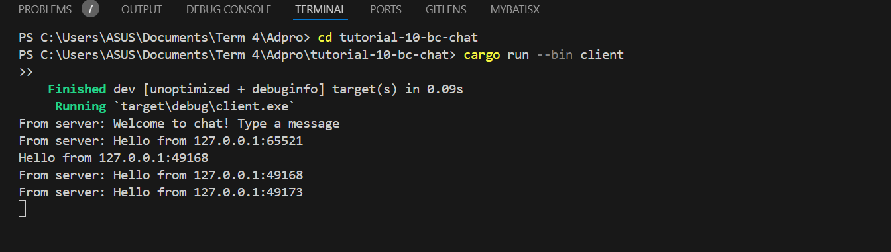
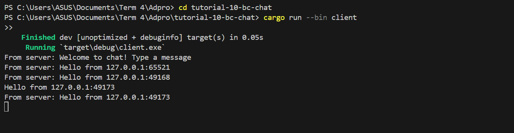

Dari ketiga gambar di atas, bisa diketahui bahwa setelah server dan tiga client dijalankan, output dari setiap client dan server menerima pesan yang diketikkan oleh tiap client. Hal ini bisa dilihat dengan jelas, bahwa ketika saya mengetikkan secara berurutan mulai dari client 1 hingga 3, client lain akan juga mendapatkan pesan sesuai dengan apa yang saya ketikkan di client tertentu. Hal ini disebabkan oleh pesan yang saya ketikkan akan dikirimkan ke server lalu akan diteruskan ke seluruh client yang terhubung dengannya.
